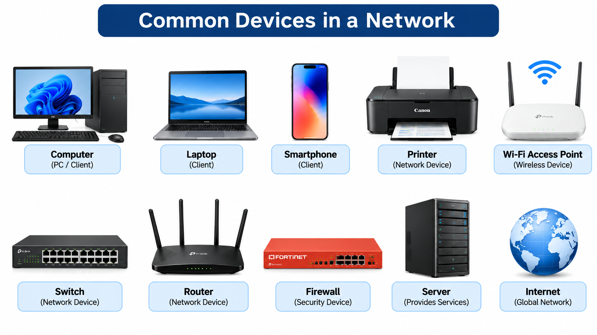
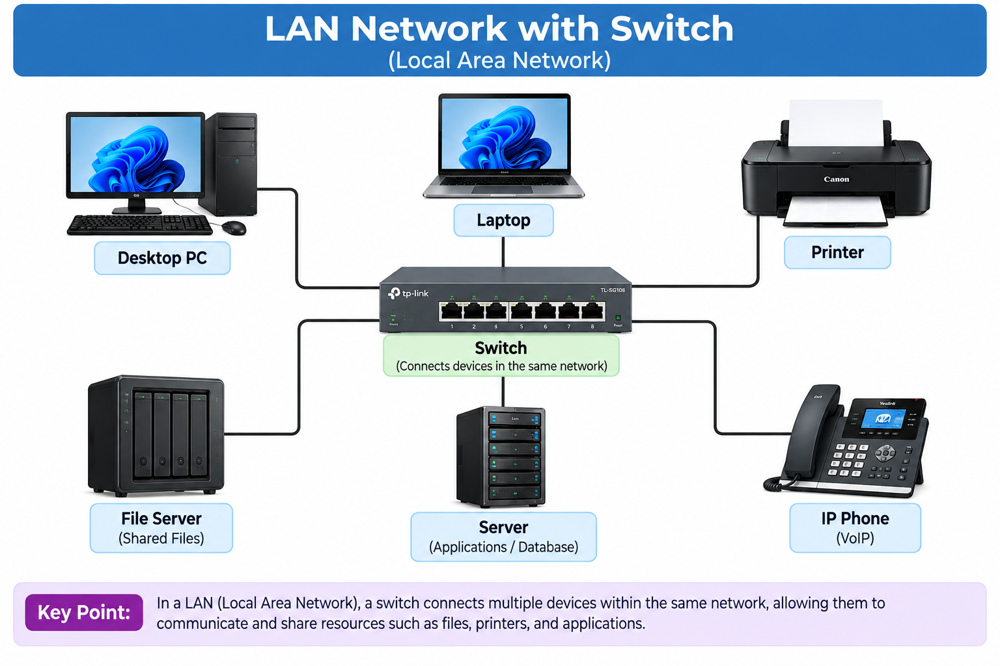
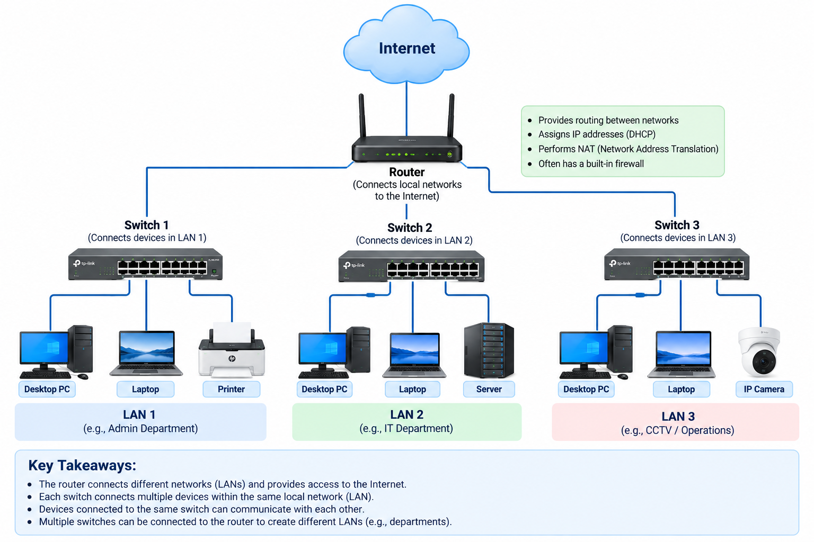
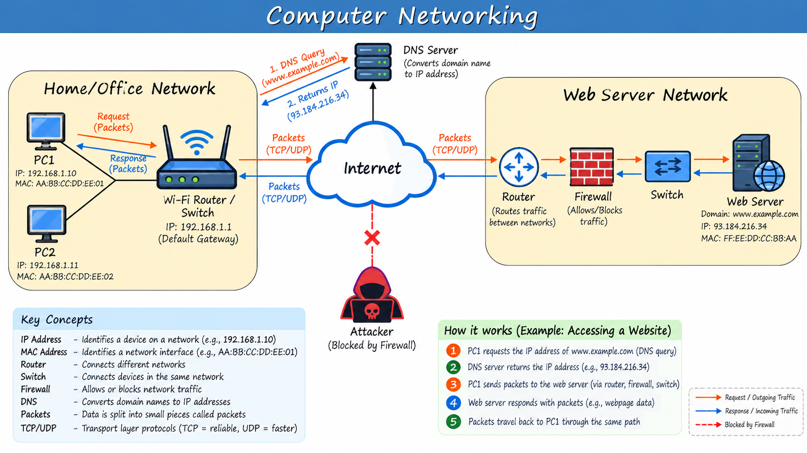

<<<<<<< HEAD
Networking is a collection of interconnected devices that communicate with each other to exchange data and resources.

# what are interconnected Devices?
- Below image gives the clarity about the devices that we use in network to connect

    

## Lets Break down what each device founction in the network 

## Computer(PC/Client)
- A Computer or a client that accesses services made available by the server. or a device which is looking for a service is called a client device

## Server 
- It is a device that provides functions or services for clients. or a device which is providing the service is called a server.

## Switch
- A network switch is a device used to connect multiple devices-such as computers, printers, and servers-within a network. 
- switches provide connectivity to the hosts within the same LAN(Local Area Network).
- Switches don't provide connectivity between Lan/over the internet.

    

## Router
- A router have fewer network interfaces than a switch.
- Roters are used to provide connectivity between the LANs.
- Routers are therefore used to send data over the internet.

    

## Firewall
- Firewall monitor and control network traffic based on configured   rules.
- Firewall can be placed inside the network or outside the network.
- Firewalls are known as 'Next-Generation firewalls' when they include  more modern and advanced filtering capabilities.

    

    

=======
Networking is a collection of interconnected devices that communicate with each other to exchange data and resources.

# what are interconnected Devices?
- Below image gives the clarity about the devices that we use in network to connect

    

## Lets Break down what each device founction in the network 

## Computer(PC/Client)
- A Computer or a client that accesses services made available by the server. or a device which is looking for a service is called a client device

## Server 
- It is a device that provides functions or services for clients. or a device which is providing the service is called a server.

## Switch
- A network switch is a device used to connect multiple devices-such as computers, printers, and servers-within a network. 
- switches provide connectivity to the hosts within the same LAN(Local Area Network).
- Switches don't provide connectivity between Lan/over the internet.

    

## Router
- A router have fewer network interfaces than a switch.
- Roters are used to provide connectivity between the LANs.
- Routers are therefore used to send data over the internet.

    

## Firewall
- Firewall monitor and control network traffic based on configured   rules.
- Firewall can be placed inside the network or outside the network.
- Firewalls are known as 'Next-Generation firewalls' when they include  more modern and advanced filtering capabilities.

    

    

>>>>>>> 5b3014f (updated)
