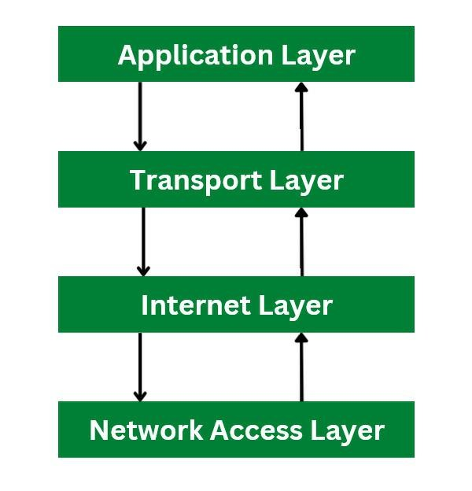

## TCP/IP Model
- The TCP/IP Model is a conceptual framework that explains how data travels from one device to another over a network
- It is a four layered model which explains the process of data communication in a network consisting of Application, Transport, Internet, and Network Access layers.



# Lets Breakdowm each layer

# 1. Application Layer
- The application layer is the top most layer in the TCP/IP model
- A HTTP/HTTPS request is generated from the application layer.
- The application layer uses different protocols. 
```text
Common                Protocols
Protocol	            Purpose
HTTP	                Transfer web pages
HTTPS	                Secure web communication
DNS	                    Converts domain names into IP addresses
FTP	                    File transfer
SSH	                    Secure remote access
SMTP	                Sending emails
```
Ex: 
When you type:

https://google.com

into your browser, the browser uses HTTPS to communicate with Google's server

# 2. Transport Layer

The Transport Layer provides communication between applications running on different devices.

It is responsible for delivering data from one application to another.

The two main transport-layer protocols are:

- TCP
- UDP

TCP — Transmission Control Protocol

TCP provides reliable and ordered communication.

It includes:

- Reliable delivery
- Error detection
- Retransmission of lost data
- Sequencing
- Flow control
- Connection-oriented communication

For example, when downloading a file, losing part of the file could make it unusable. TCP can retransmit missing data.

TCP Examples
- HTTPS
- HTTP
- SSH
- FTP

UDP — User Datagram Protocol

UDP is a connectionless transport protocol.

It focuses on speed and low overhead rather than guaranteed delivery.

UDP does not provide built-in:

Guaranteed delivery
- Retransmission
- Packet ordering

UDP Examples
- DNS
- Online gaming
- Voice calls
- Video communication
- Real-time applications

# Port Numbers

The Transport Layer also uses port numbers to identify applications or services.

For example:

```text
IP Address       Port
142.250.x.x      443
                  ↑
              HTTPS
```

An IP address identifies the destination device, while a port identifies the service/application on that device.

# 3. Internet Layer

The Internet Layer is responsible for logical addressing and routing.

Its main job is to determine where packets need to go and help move them between different networks.

Main Protocols

- IPv4
- IPv6
- ICMP

# IP Address

An IP address identifies a device/interface on an IP network.

Example:

192.168.1.10

When a device sends data, the packet contains information such as:

Source IP      → 192.168.1.10
Destination IP → 142.250.x.x

Routers examine the destination IP address and forward the packet toward the appropriate network.

 Main Device 

The device most closely associated with this layer is the:

Router

A router connects different networks and forwards IP packets between them.

# 4. Network Access Layer

The Network Access Layer is the lowest layer of the TCP/IP model.

It is responsible for communication over the local network or physical network connection.

It combines functions related to the data-link and physical layers.

Examples
Ethernet
Wi-Fi
MAC addresses
Network interface cards (NICs)
Ethernet cables
Wireless communication

#  MAC Address

A MAC address is used for communication on the local network.

Example:

00:1A:2B:3C:4D:5E

While an IP address is used for logical communication between networks, a MAC address is used for local network communication.

Common Devices
- Switch
- Wireless Access Point
- Network Interface Card (NIC)

## How Data Travels Through the TCP/IP Model

Let's take a simple example:

You open https://google.com in your browser.

The data passes through the TCP/IP layers.

```text
     Your Browser
           │
           ▼
┌──────────────────────┐
│ Application Layer    │
│ HTTPS                │
└──────────┬───────────┘
           │
           ▼
┌──────────────────────┐
│ Transport Layer      │
│ TCP + Port 443       │
└──────────┬───────────┘
           │
           ▼
┌──────────────────────┐
│ Internet Layer       │
│ Source/Destination IP│
└──────────┬───────────┘
           │
           ▼
┌──────────────────────┐
│ Network Access       │
│ Wi-Fi / Ethernet     │
└──────────┬───────────┘
           │
           ▼
        Network
           │
           ▼
     Google Server
```

Each layer adds information required by that layer before passing the data to the layer below it.

# Encapsulation & Decapsulation


The TCP/IP model explains how data is created by an application, transported between devices, routed across networks, and finally delivered through a local network connection.
