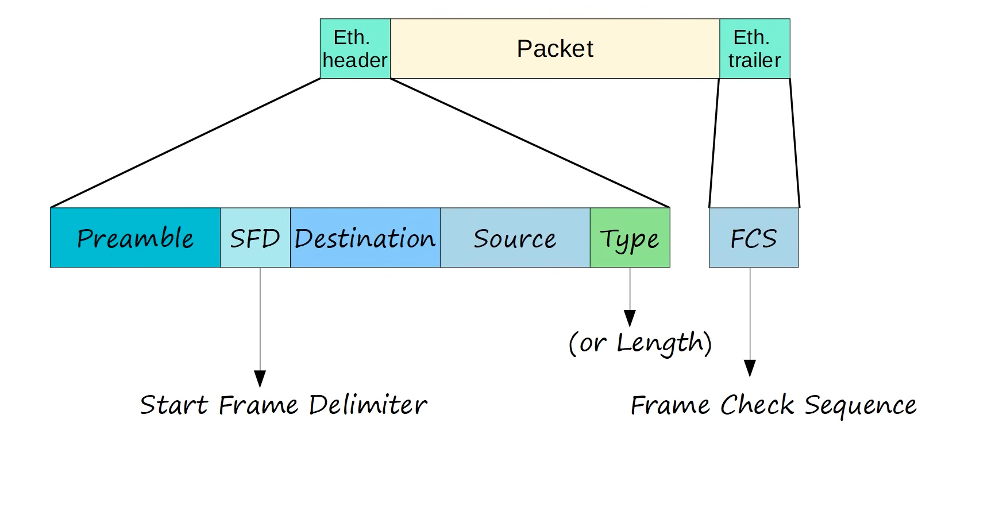

Protocol Data Unit (PDU) is the name given to data as it moves through each layer of a networking model.

    PDU = The form that data takes at a particular network layer.

## PDU in the TCP/IP Model
```text
┌─────────────────────────────┐
│ Application Layer           │
│          Data               │
├─────────────────────────────┤
│ Transport Layer             │
│    Segment / Datagram       │
├─────────────────────────────┤
│ Internet Layer              │
│          Packet             │
├─────────────────────────────┤
│ Network Access Layer        │
│          Frame              │
└─────────────────────────────┘
```

# 1. Application Layer → Data
- The request generate at the application layer is called Data
 Example:
        "https://google.com"
At this point, we generally call it Data

# 2. Transport Layer → Segment / Datagram
- The Transport Layer adds a TCP or UDP header.
With TCP:
```text 
TCP Header + Data
        ↓
     Segment
```
With UDP:
```text
UDP Header + Data
        ↓
     Datagram
```
The TCP/UDP header contains information such as source and destination ports.

# 3. Internet Layer → Packet
- The Internet Layer adds an IP header.
```text
IP Header
   +
TCP Header
   +
Data
   ↓
Packet
```
The IP header contains information such as:
```text
Source IP
Destination IP
```
# 4. Network Access Layer → Frame
- The Network Access Layer adds information needed for the local network

```text 
Frame Header
     +
IP Header
     +
TCP Header
     +
Data
     ↓
   Frame
```
This frame can then be transmitted through Ethernet or Wi-Fi.



# Lets breakdown the image

## Preamble 
- Length : 7 bytes (56 bits)
- Alternating 1's & 0's
- 10101010 * 7
- Its main purpose is synchronization.
- Allows devices to synchronize theire receiver clocks

## SFD — Start Frame Delimiter
- Length : 1 byte (8 bits)
- 10101011
- Marks the end of the preamble, and the beginning of the rest of the frame

## Destination & Source
- The Destination field contains the destination MAC address.
- The Source field contains the source MAC address.
- Indicated the devices sending and receiving the frame
- Both have 6 byte(48 bit) address of the physical device

# Type or Length 
- 2 byte (16 bit) field
- The Type field tells the receiver what protocol is contained inside the Ethernet payload. 
Ex: 
```text
Type = 0x0800 → IPv4
Type = 0x86DD → IPv6
Type = 0x0806 → ARP
```
So if the Type field says 0x0800, the Ethernet frame is carrying an IPv4 packet

Try to remember the lentha of the each field


# FCS - Frame Check Sequence
- 4 bytes (32 bits) in length
- Detects corrupted data by running a 'CRC' algorithm over the recived data 
- CRC = 'Cyclic Redundancy Check'

