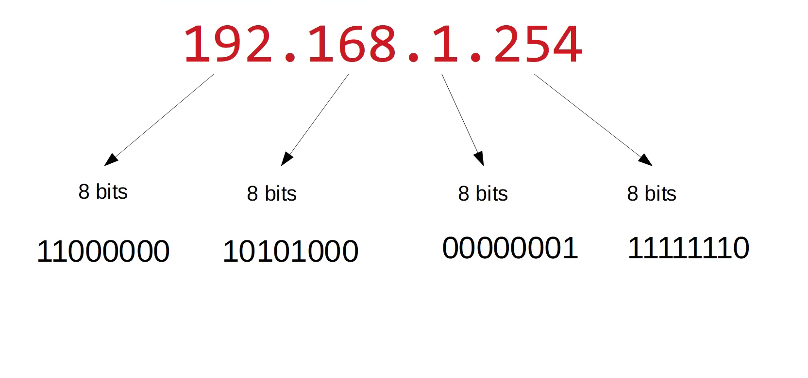
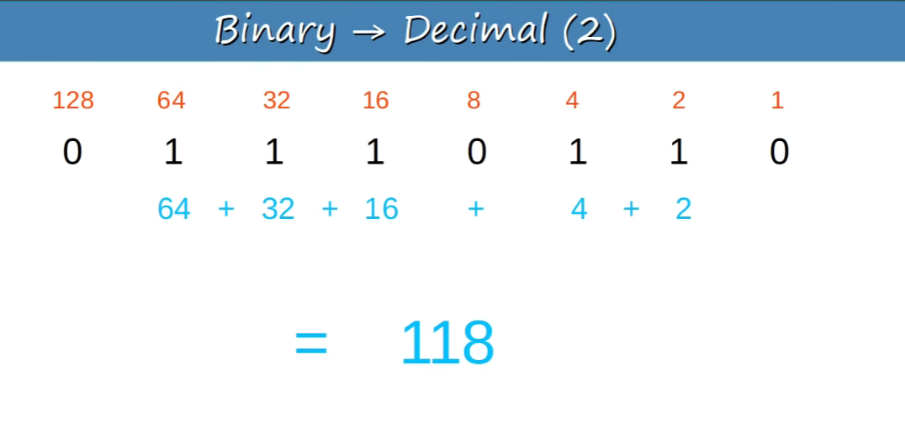

# IPv4 Address
- IPv4(Internet Protocol version4) is a system used to identify devices on a network so that data can be delivered to the correct destination.
- A IPv4 address is a 32-bit numeber, divided into 4 octets, each conataining 8 bits.


# What is Binary?
- Binary is a base-2 number system, it uses only two digits 0 & 1.

## The 8-bit binary places values
- For an IPv4 octet, the position always have these values:

```text
128   64   32   16   8   4   2   1
 ↓     ↓    ↓    ↓   ↓   ↓   ↓   ↓
 2⁷    2⁶   2⁵   2⁴  2³  2²  2¹  2⁰
 ```
## Binary -> Decimal
 

## Decimal -> Binary
How Do we convert a decimal number into binary? 


# What does an IPv4 address tell us?
An IPv4 address has teo logical parts
```text
IPv4 Address
     │
     ├── Network portion → identifies the network
     │
     └── Host portion    → identifies the device
```
```text
192.168.1 | 10
-----------|---
 Network   | Host
 ```
So:
- Network address: 192.168.1.0
- Host: 10
- Broadcast address: 192.168.1.255
- usable host range: 192.168.1.1 - 192.168.1.254

IPv4 is a 32-bit logical addressing system used to uniquely identify decvices/interfaces on an IPv4 network and enable communication between them.
 

