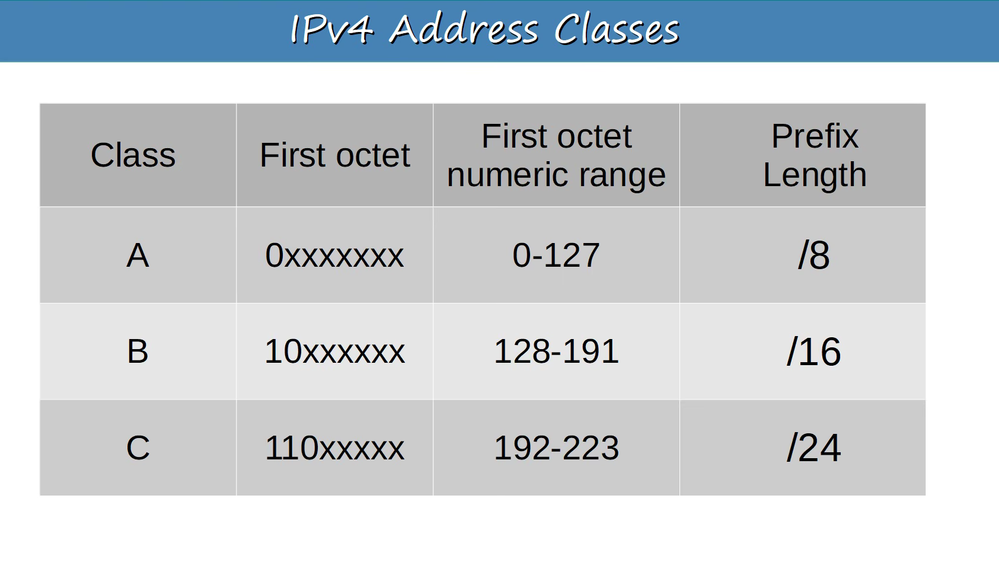
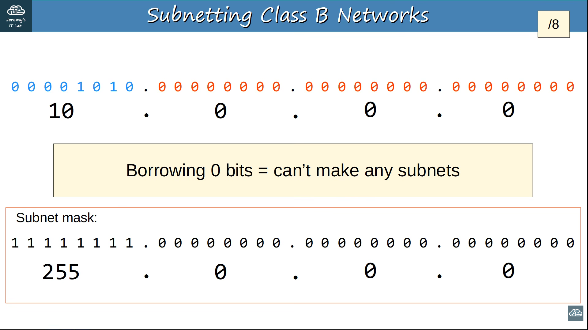

# Subnetting
- Subnetting is the process of diving the large network into smaller networks called subnets.
- In subnetting, we borrow bits from the host portion of an ip address use them to create additional nework/subnet portions.

## Why Do We Use Subnetting?
One of the major reasons subnetting was introduced was to reduce the wastage of IP addresses.

## The problem with the old classful system
Originally, IPv4 addresses were divided into fixed classes:

```text
 Class      Default Prefix    Number of Hosts 

 Class A       /8             ~16.7 million 
 Class B       /16                  ~65,534 
 Class C       /24                      254 
```


Imagine a compnay has 500 devices.
- A Class C network provides only 254 usable host addresses. So Class C is too small.
- The company would need a Class B network where the company will get 65,534 usable host addresses, but the company need only need the 500.
- That means a huge number of IP addresses would be wasted.

## Subnetting solves this problem
- Instead of assigning one huge network, we can divide a network into smaller networks that better match the number of devices required. 
- Subnetting helps reduce IP address wastage by dividing a large network into smaller networks of appropriate sizes.

## CIDR and Subnetting
#### Classless Inter-Domain Routing
- CIDR was introduced to overcome the limitations of the old classful addressing system.
- Instead of being restricted to fixed Class A, B, or C network sizes, CIDR allows us to specify the network portion using a prefix length such as:
```text 
/8
/16
/20
/24
/26
/27
/28
```
### CIDR Host Formula
When you have a CIDR prefix such as /24, the remaining bits are host bits.
Usable hosts = 2ⁿ − 2
Where:
- n = number of host bits
- 2ⁿ = total IP addresses
- −2 = exclude the network address and broadcast address

Example: 192.168.1.0/24
IPv4 has 32 bits:
32 - 24 = 8 host bits
Therefore:
Usable hosts = 2⁸ - 2
             = 256 - 2
             = 254 hosts

#### The process of subnetting Class A, Class B, and Class C networks is EXACTLY SAME!
#### Suppose we have a Class A
Example:
    10.0.0.0/8



```text
Initially:
NNNNNNNN.HHHHHHHH.HHHHHHHH.HHHHHHHH
We have:
8 Network bits
24 Host bits
Suppose we borrow 8 bits:
NNNNNNNN.BBBBBBBB.HHHHHHHH.HHHHHHHH
Now:
/8 + 8 = /16
Number of subnets:
2⁸ = 256 subnets
Remaining host bits:
24 - 8 = 16
Addresses per subnet:
2¹⁶ = 65,536
2¹⁶ = 65,536
65,536 - 2
= 65,
So:
10.0.0.0/8
     ↓
    /16
     ↓
256 smaller networks
```
"Subnetting is the process of dividing a larger IP network into smaller networks by borrowing bits from the host portion, allowing IP addresses to be used more efficiently"