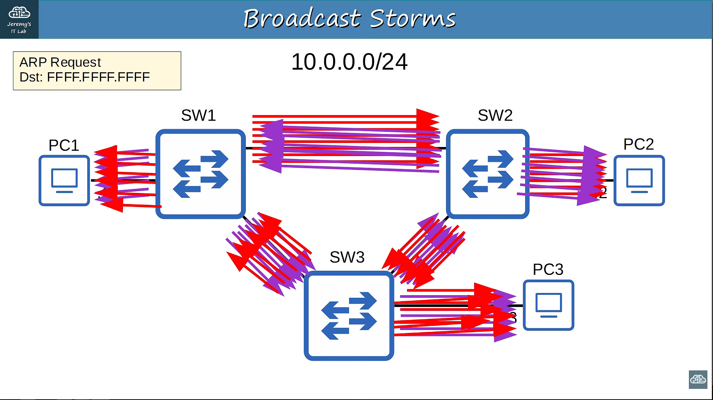
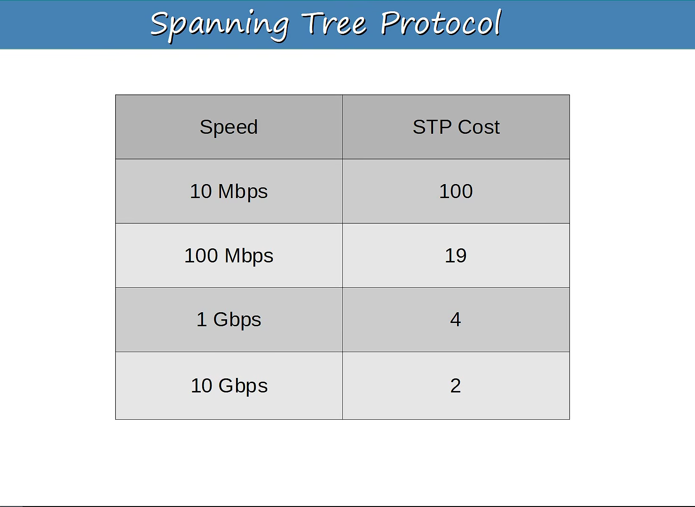

# Spanning Tree Protocol (STP)
- Spanning Tree Protocol (STP) is a Layer 2 protocol used in switched networks to prevent Layer 2 loops while allowing redundant physical connections for network resilience.
- STP creates a loop-free logical topology by selecting which links should forward traffic and which redundant links should be placed into a blocking state.

### Why do we need STP?
- There are multiple physical paths between the switches.
- This redundancy is useful because if one link fails, another path can provide connectivity.
- However, the same redundancy can create a Layer 2 loop.

Therefore:

```text
Redundant Links
      ↓
Layer 2 Loops
      ↓
Broadcast Storms
      ↓
Network Instability
      ↓
     STP
      ↓
Loop-free logical topology
```

## Network Redundancy
- Redundancy means providing an additional path or device that can be used if the primary path or device fails.
Example:

```text
    Switch A
    /        \
   /          \
Switch B ───── Switch C
```
If the connection between A and B fails, another path may still exist.

The same redundant links that provide resilience can create Layer 2 loops.

## Layer 2 Loops and Broadcast Storms
- A Layer 2 loop occurs when Ethernet switches have multiple active paths between them, allowing frames to circulate continuously.

Example:
```text
Switch A
   ↓
Switch B
   ↓
Switch C
   ↓
Switch A
   ↓
Switch B
   ↓
...
```


#### This can consume network bandwidth and resources.

### Duplicate Frames
The same Ethernet frame can reach a destination multiple times.

### MAC Address Instability
Switches may repeatedly learn the same MAC address on different ports.

### Network Outage
Eventually, the network can become severely degraded or unavailable.

Therefore:
#### We need a mechanism that keeps redundancy but prevents loops.Which is SPT

### STP BPDUs and Root Bridge Election
- BPDU = Bridge Protocol Data Unit
- BPDUs are STP control messages exchanged between switches.
- They contain information used by STP, including:
   a. Bridge ID
   b. Bridge priority
   c. MAC address
   d. Path cost
   e. Port information
   #### Important: A switch does not simply forward a received BPDU like a normal Ethernet frame. It uses the information it receives to construct/generate STP information of its own.

### Root Bridge Election
STP first needs a reference point for the network.
#### Root Bridge
The Root Bridge is elected using the lowest Bridge ID.

```text
Bridge ID
    │
    ├── Bridge Priority
    │
    └── MAC Address
```
- The switch with the lowest Bridge ID becomes the Root Bridge.
- If priority is equal, the switch with the lower MAC address wins

```text
Switch A → Priority 32768, MAC ...001
Switch B → Priority 32768, MAC ...002
Switch C → Priority 32768, MAC ...003

Winner → Switch A
```
The Root Bridge becomes the logical center/reference point of the spanning tree.

## STP Path Cost and Root Port Selection
- Once the Root Bridge is elected, every non-root switch needs to determine:
- STP uses path cost to make this decision.
### What is STP Cost
- STP cost is a value associated with a path/link, primarily based on its bandwidth.

```text
Higher bandwidth
       ↓
Lower cost
       ↓
More preferred path
```



### Root Port Selection
- Every non-root switch selects one Root Port.
- Root Port = the port providing the best path toward the Root Bridge.

## Designated Port Selection
- A Designated Port (DP) is the port selected to forward traffic for a particular Layer 2 segment and is the port that provides the best BPDU/path toward the Root Bridge.

```text
Root Bridge
   │
   │ DP
   │
Switch B
   │
   │ DP
   │
Switch C
```
The Root Bridge's forwarding ports are Designated Ports

## Non-Designated Port Selection
- At this point, STP has selected the ports that should participate in the active forwarding topology.

But we still have redundant paths.

Example:
```text
  Root
 /    \
/      \
B ───── C
```
Suppose:
```text
Root → B → C
```
is already the preferred path.
- The direct B-C link is redundant.
- STP therefore needs to decide:
> Which port should not forward traffic?
This results in a non-designated/blocking port in traditional STP.

## STP Port States
- Now that you understand why ports are selected, we can discuss what those ports actually do.

Traditional 802.1D STP has five port states:

```text 
Disabled
Blocking
Listening
Learning
Forwarding
```
### Blocking
- Does not forward normal data traffic
- Receives BPDUs
- Prevents the redundant path from creating a loop
### Listening
- Participates in STP
- Does not forward user traffic
- Does not learn MAC addresses
### Learning
- Begins learning MAC addresses
- Still does not forward normal user traffic
### Forwarding
- Forwards normal traffic
- Learns MAC addresses
- Participates in the active topology

```text
Blocking
   ↓
Listening
   ↓
Learning
   ↓
Forwarding
```
## STP Timers
STP uses timers to control how the spanning-tree topology is built and maintained.

The three traditional STP timers you should know are:

#### 1. Hello Timer
Controls how frequently STP hello BPDUs are generated.

#### 2. Forward Delay
Controls how long a port remains in:

```text
Listening
     ↓
Learning
```
before moving toward forwarding.

#### 3. Max Age
Determines how long STP keeps received topology information before considering it expired if it isn't refreshed.

#### Why are timers needed?
They prevent switches from immediately making potentially unsafe topology changes while the network is still converging.

## STP Toolkit — PortFast
Traditional STP goes through states such as:

```text 
Listening
    ↓
Learning
    ↓
Forwarding
```
This introduces a delay before an end device can use the network.

For a PC, printer, or server, this delay is generally unnecessary because an ordinary end device does not create a Layer 2 switching loop.

PortFast allows an edge/access port to move directly to the forwarding state when the link comes up

```text
Normal STP:

Listening → Learning → Forwarding


PortFast:

             ┌──────────────→ Forwarding
             │
Link Up ─────┘
```
> PortFast should be used on ports connected to end devices, not normal switch-to-switch links.

## STP Toolkit — BPDU Guard
PortFast leads naturally to BPDU Guard.

If a port is configured as an end-device port, we normally don't expect it to receive BPDUs.

But imagine someone connects another switch:

```text
Switch
  │
  │ PortFast + BPDU Guard
  │
  └────── Rogue Switch
```
The rogue switch can send BPDUs.

#### BPDU Guard protects the PortFast edge by disabling the port if a BPDU is received. On Cisco platforms, this can place the port into an errdisable state.

```text
Normal:

PC ─────── PortFast port
             ↓
          No BPDU
             ↓
          Everything OK


Attack/misconfiguration:

Rogue Switch ─── PortFast port
                    ↓
                  BPDU
                    ↓
              BPDU Guard
                    ↓
              Port disabled
```

This helps prevent an unauthorized switch from influencing the STP topology or attempting to become the Root Bridg