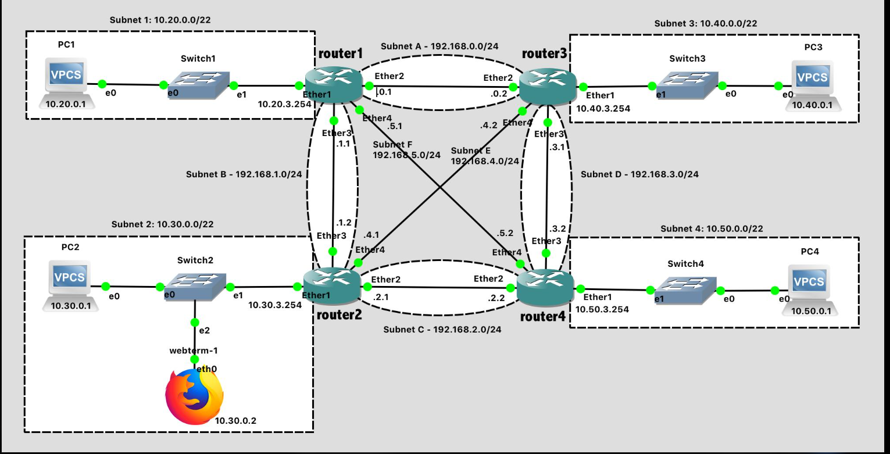

# Dynamic Routing
- Dynamic routing is a process in which routers automatically learn network routes, exchange routing information with other routers, and update their routing tables when network conditions change
- Instead of an administrator manually configuring every route, routers use routing protocols to discover and select paths to destination networks.

Suppose Router A needs to send data to a network connected to Router C.
- Router A learns about available routes through a routing protocol.
- It selects a suitable path to reach Router C's network.
- If the selected path fails, the routers can exchange updated routing information and choose an alternative path, if one is available.

This ability to adapt to network changes is the main advantage of dynamic routing.

## How does dynamic routing work?
### Step 1: Discover neighboring routers
Routers running a compatible routing protocol discover or establish relationships with neighboring routers.

### Step 2: Exchange routing information
Routers share information about destination networks and routes, according to the protocol they use.

### Step 3: Select the best route
The router uses the protocol's route-selection rules to choose a preferred path to each destination.

### Step 4: Update routes when conditions change
If a route fails or a better route becomes available, the router can recalculate and update its routing table.

## Dynamic routing protocols
Routers use routing protocols to learn routes and determine how to reach destination networks.

### RIP — Routing Information Protocol
Uses hop count as its routing metric. A route can have at most 15 hops to be considered reachable; 16 means unreachable.

### OSPF — Open Shortest Path First
A link-state protocol that builds a view of network topology and uses the Shortest Path First algorithm to calculate routes.

### BGP — Border Gateway Protocol
Exchanges routing information between autonomous systems and uses routing policies and path attributes to select routes.

### EIGRP — Enhanced Interior Gateway Routing Protocol
Uses a composite metric and the DUAL algorithm to calculate loop-free routes and support fast convergence.

## What is a routing metric?
- A routing metric is a value or set of attributes used to evaluate routes.

Consider two possible paths to the same destination:

### What happens when a link fails?
Suppose Router A reaches a destination through Router B. If that link goes down, the routing protocol detects the change and updates its route information.

The process of adapting to network changes is called convergence.

Convergence is not necessarily instantaneous. It depends on the protocol, network configuration, failure-detection mechanisms and topology.

This matters in cybersecurity because routing changes can also be malicious or misconfigured. For example, a false route advertisement can redirect traffic, while BGP route leaks can send traffic along unintended paths.